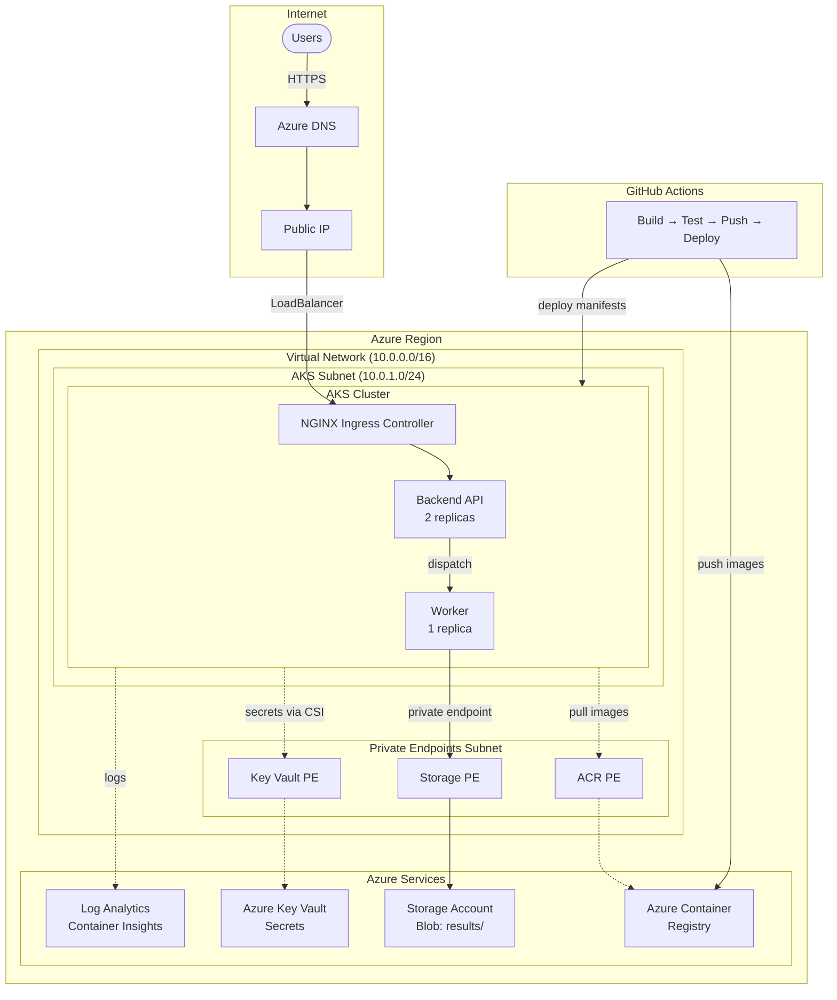

# Azure AKS Platform - Technical Challenge

A cloud-hosted application platform on Azure consisting of a backend API and a background worker service, deployed on Azure Kubernetes Service (AKS) with Infrastructure as Code and CI/CD automation.

## Architecture Overview

This platform runs on Azure with AKS as the compute layer, using Azure-native services for observability, secrets management, and container registry.



### Traffic Flow

1. **Inbound**: Users → Azure DNS → Public IP → NGINX Ingress → Backend API → Pods
2. **Processing**: Backend API dispatches work → Worker processes → Results stored in Blob Storage
3. **Storage**: Worker → Private Endpoint → Storage Account (no public internet)
4. **Secrets**: Pods mount secrets from Key Vault via CSI driver (workload identity)
5. **Logs**: All pods → Container Insights → Log Analytics Workspace
6. **CI/CD**: Code push → Build → Test → Push image to ACR → Deploy manifests to AKS

---

## Key Decisions

| Component | Choice | Rationale |
|-----------|--------|-----------|
| **Ingress** | NGINX Ingress Controller | Portable, well-documented, deployed as pods. No Azure-specific lock-in. Can be replaced with Azure Application Gateway if WAF is required. |
| **Networking** | Azure CNI | Pods get VNet IPs directly. Required for network policies, better integration with Azure services, and simplified debugging. |
| **Storage** | Azure Blob Storage + Private Endpoint | Worker stores processing results. Private endpoint keeps traffic within VNet—no public internet exposure. |
| **Secrets** | Azure Key Vault + CSI Driver | Secrets never stored in cluster etcd. Centralized management with audit logging and rotation support. |
| **Identity** | Managed Identity | Eliminates credential management. AKS uses system-assigned identity for Azure resource access. Worker uses workload identity for Storage access. |
| **High Availability** | Multi-AZ node pool (prod) | Production: nodes spread across zones 1, 2, 3. Free tier: single zone (AZ not available). |
| **Observability** | Container Insights + Log Analytics | Native Azure integration, unified view of cluster and application metrics/logs. |

### Production Considerations

- **NAT Gateway**: Not included since all traffic stays within the VNet (private endpoints for storage, ACR, Key Vault). Add if workloads require outbound internet access with predictable static IPs (e.g., external APIs, webhooks).
- **Private endpoints scope**: Key Vault, Storage, and ACR use private endpoints because they handle sensitive data (secrets, business data, application code). Log Analytics does not—it receives outbound telemetry over TLS, and privatizing it requires Azure Monitor Private Link Scope (AMPLS) with multiple DNS zones, adding complexity for limited security gain. Consider AMPLS only for highly regulated environments.
- **Azure Application Gateway (AGIC)**: Better choice if WAF, SSL offloading at the edge, or Azure-native L7 load balancing is required. Adds complexity and Azure lock-in.
- **Kubenet networking**: Lower IP consumption but limited network policy support. Use when IP address space is constrained.
- **Azure PostgreSQL Flexible Server**: Add if workloads require a managed relational database with zone-redundant HA.

---

## Quick Start

See **[DEPLOYMENT.md](DEPLOYMENT.md)** for complete deployment instructions, including:
- Prerequisites and tool installation
- **Free tier subscription guidance** (recommended regions, VM sizes, limitations)
- Step-by-step deployment walkthrough
- Troubleshooting common issues
- Cost estimation

---

## Infrastructure (Terraform)

The infrastructure is defined as Terraform modules in the `terraform/` directory.

### Azure Verified Modules (AVM)

This project uses [Azure Verified Modules](https://azure.github.io/Azure-Verified-Modules/) — Microsoft's official, production-ready Terraform modules. Our local modules are thin wrappers that configure AVMs with sensible defaults.

| Resource | Module | Notes |
|----------|--------|-------|
| VNet + Subnets | `Azure/avm-res-network-virtualnetwork/azurerm` | Built-in subnet management, service endpoints, NSG association |
| AKS Cluster | Direct `azurerm_kubernetes_cluster` | Direct resource for free tier compatibility (AVM production pattern requires availability zones) |
| Key Vault | `Azure/avm-res-keyvault-vault/azurerm` | RBAC, private endpoints, secrets/keys/certs management |
| Storage Account | `Azure/avm-res-storage-storageaccount/azurerm` | Blob containers, private endpoints, lifecycle policies |
| Log Analytics | `Azure/avm-res-operationalinsights-workspace/azurerm` | Workspace config, retention, diagnostic settings |

> **Note**: The AKS module uses a direct `azurerm_kubernetes_cluster` resource instead of AVM's `avm-ptn-aks-production` pattern. This is because the AVM production pattern enforces availability zones, which are not available on free Azure subscriptions. See [DEPLOYMENT.md](DEPLOYMENT.md) for details.

**Benefits of AVM:**
- Microsoft-maintained with regular security updates
- Production-ready defaults and best practices built-in
- Reduced maintenance burden — we configure, not implement
- Consistent module interface across all Azure resources

### Module Structure

```
terraform/
├── main.tf              # Root module - wires everything together
├── variables.tf         # Input variables
├── outputs.tf           # Output values
├── providers.tf         # Provider configuration
└── modules/             # Thin wrappers around AVM
    ├── networking/      # → avm-res-network-virtualnetwork
    ├── aks/             # → avm-ptn-aks-production
    ├── monitoring/      # → avm-res-operationalinsights-workspace
    ├── keyvault/        # → avm-res-keyvault-vault
    └── storage/         # → avm-res-storage-storageaccount
```

### Usage

```bash
cd terraform

# Initialize providers and modules
terraform init

# Review planned changes
terraform plan -var-file="environments/dev.tfvars"

# Apply infrastructure (requires Azure credentials)
terraform apply -var-file="environments/dev.tfvars"
```

### Required Variables

| Variable | Description | Example |
|----------|-------------|---------|
| `environment` | Environment name | `dev`, `staging`, `prod` |
| `location` | Azure region | `westeurope` |
| `resource_prefix` | Prefix for resource names | `myapp` |

---

## Application Deployment (Kubernetes)

Kubernetes manifests are in the `kubernetes/` directory.

### Manifest Structure

```
kubernetes/
├── namespace.yaml           # Namespace and ServiceAccount
├── secret-provider-class.yaml  # Key Vault CSI configuration
├── configmap.yaml           # Non-sensitive configuration
├── backend-api/
│   ├── deployment.yaml      # Backend API deployment
│   ├── service.yaml         # ClusterIP service
│   └── ingress.yaml         # NGINX ingress rules
└── worker/
    └── deployment.yaml      # Background worker deployment
```

### Deployment

```bash
# Deploy all manifests
kubectl apply -f kubernetes/

# Or deploy in order
kubectl apply -f kubernetes/namespace.yaml
kubectl apply -f kubernetes/secret-provider-class.yaml
kubectl apply -f kubernetes/configmap.yaml
kubectl apply -f kubernetes/backend-api/
kubectl apply -f kubernetes/worker/
```

### Prerequisites

1. NGINX Ingress Controller installed in cluster
2. Azure Key Vault CSI driver enabled (via AKS add-on)
3. Workload identity configured for Key Vault access

---

## CI/CD Pipeline

GitHub Actions workflows (`.github/workflows/`) automate build, test, and deployment.

### Pipeline Stages

```
┌──────────┐    ┌──────────┐    ┌──────────┐    ┌──────────┐
│  Build   │───▶│  Test    │───▶│  Push    │───▶│  Deploy  │
│          │    │          │    │  to ACR  │    │  to AKS  │
└──────────┘    └──────────┘    └──────────┘    └──────────┘
```

1. **Build**: Compile application, run linting
2. **Test**: Execute unit and integration tests
3. **Push**: Build Docker image, push to Azure Container Registry
4. **Deploy**: Apply Kubernetes manifests to target environment

### Environment Promotion

- **Dev**: Automatic deployment on push to `develop` branch
- **Staging**: Automatic deployment on push to `main` branch
- **Production**: Manual approval via GitHub Environments

### Required Secrets

- `AZURE_CREDENTIALS` - Service principal for Azure authentication
- `ACR_LOGIN_SERVER` - Azure Container Registry URL
- `AKS_CLUSTER_NAME` - Target AKS cluster name
- `AKS_RESOURCE_GROUP` - Resource group containing AKS

---

## Observability

### Logging

- **Container Insights**: Collects stdout/stderr from all containers
- **Log Analytics Workspace**: Centralized log storage and querying
- **Query examples**:

```kusto
// Container logs from backend-api
ContainerLogV2
| where ContainerName == "backend-api"
| where LogLevel == "Error"
| project TimeGenerated, LogMessage
| order by TimeGenerated desc
```

### Metrics

- **Container Insights metrics**: CPU, memory, network, disk I/O per pod/node
- **Azure Monitor metrics**: AKS cluster-level metrics
- **Custom metrics**: Application-level metrics via Prometheus annotations (optional)

### Alerting

Recommended alerts:

| Alert | Condition | Severity |
|-------|-----------|----------|
| Pod restart loop | Restart count > 5 in 10 min | Critical |
| High CPU usage | Node CPU > 80% for 5 min | Warning |
| High memory usage | Node memory > 85% for 5 min | Warning |
| Deployment failed | Deployment status != Available | Critical |
| Ingress 5xx errors | Error rate > 1% for 5 min | Warning |

---

## Security

### Identity & Access Management

- **Azure RBAC**: Controls who can manage the AKS cluster and Azure resources
- **Kubernetes RBAC**: Controls what service accounts and users can do within the cluster
- **Managed Identity**: AKS uses system-assigned identity; no service principal secrets to manage

### Network Security

- **Private AKS subnet**: Workloads isolated in dedicated subnet
- **Network Security Groups**: Only allow necessary traffic (HTTPS inbound, internal VNet)
- **Network Policies**: (Optional) Kubernetes-level traffic rules between pods

### Secret Management

- **Azure Key Vault**: Single source of truth for secrets
- **CSI Driver**: Mounts secrets as volumes at pod startup
- **No secrets in code**: Environment variables injected from Key Vault-synced Kubernetes secrets
- **Rotation**: Update secrets in Key Vault; pods pick up changes on restart

### Container Security

- **Image scanning**: Azure Container Registry scans images for vulnerabilities
- **Base images**: Use minimal, trusted base images (distroless, Alpine)
- **Non-root**: Containers run as non-root users
- **Read-only filesystem**: Where possible, mount root filesystem as read-only

### Security Checklist

- [ ] Enable Azure Defender for Containers
- [ ] Configure pod security standards (restricted)
- [ ] Enable audit logging for AKS
- [ ] Implement network policies for namespace isolation
- [ ] Set up vulnerability scanning in CI pipeline
- [ ] Configure RBAC with least-privilege principle

---

## Repository Structure

```
.
├── README.md                       # This file
├── DEPLOYMENT.md                   # Deployment instructions & free tier guide
├── TROUBLESHOOTING_REPORT.md       # Infrastructure issues and resolutions
├── CICD_TROUBLESHOOTING_REPORT.md  # CI/CD pipeline issues and resolutions
├── terraform/                      # Infrastructure as Code
│   ├── main.tf
│   ├── variables.tf
│   ├── outputs.tf
│   ├── providers.tf
│   ├── environments/
│   │   ├── dev.tfvars              # Dev environment config
│   │   └── dev.tfvars.example      # Example configuration
│   └── modules/
│       ├── networking/             # VNet, subnets, NSG
│       ├── aks/                    # AKS cluster (direct resource)
│       ├── acr/                    # Azure Container Registry
│       ├── monitoring/             # Log Analytics
│       ├── keyvault/               # Key Vault
│       └── storage/                # Storage Account
├── src/                            # Application source code
│   ├── backend-api/                # Flask API (Dockerfile + main.py)
│   └── worker/                     # Background worker (Dockerfile + main.py)
├── kubernetes/                     # Kubernetes manifests
│   ├── namespace.yaml
│   ├── secret-provider-class.yaml
│   ├── configmap.yaml
│   ├── backend-api/
│   │   ├── deployment.yaml
│   │   ├── service.yaml
│   │   └── ingress.yaml
│   └── worker/
│       └── deployment.yaml
└── .github/
    └── workflows/
        └── ci-cd.yaml              # GitHub Actions workflow
```
