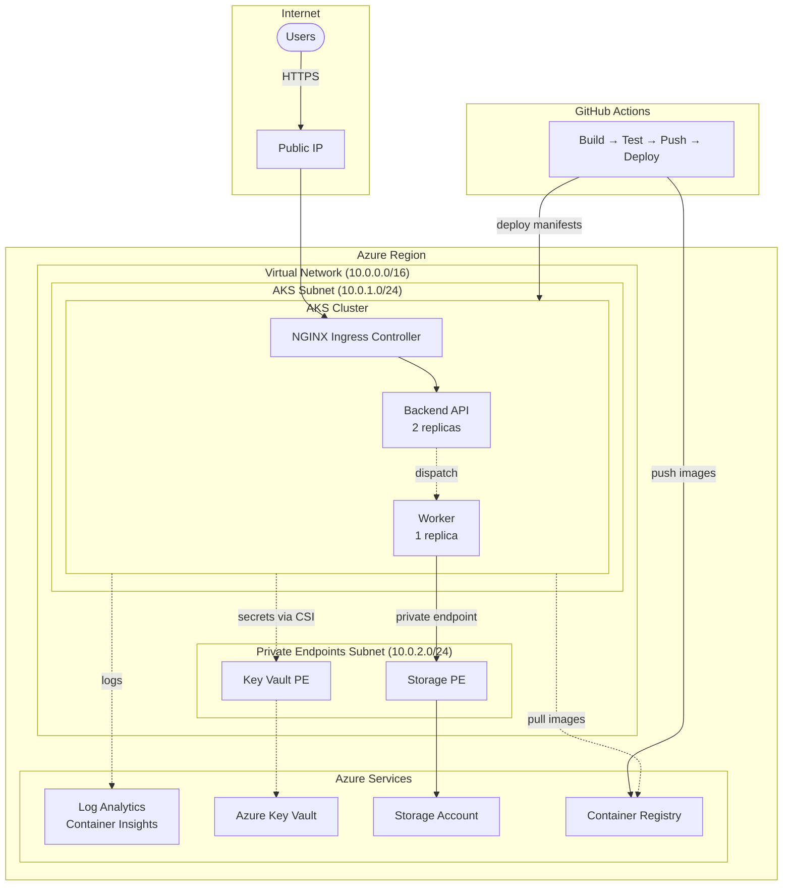

# Azure AKS Platform - Technical Challenge

A cloud-hosted application platform on Azure consisting of a backend API and a background worker service, deployed on Azure Kubernetes Service (AKS) with Infrastructure as Code and CI/CD automation.

---

## Architecture Overview



### Traffic Flow

1. **Inbound**: Users → Public IP → NGINX Ingress → Backend API
2. **Processing**: Backend API dispatches work → Worker processes → Results stored in Blob Storage
3. **Storage Access**: Worker → Private Endpoint → Storage Account (traffic stays within VNet)
4. **Secrets**: Pods mount secrets from Key Vault via CSI driver using workload identity
5. **Observability**: All containers → Container Insights → Log Analytics Workspace
6. **CI/CD**: Code push → Build → Test → Push to ACR → Deploy to AKS

---

## Key Architectural Decisions

### Ingress: NGINX Ingress Controller

Chose NGINX over Azure Application Gateway (AGIC) for portability and simplicity. NGINX runs as pods within the cluster, is well-documented, and avoids Azure-specific lock-in. The trade-off is no built-in WAF—if WAF or SSL offloading at the edge becomes necessary, migrating to Application Gateway is straightforward.

### Networking: Azure CNI

Selected Azure CNI over Kubenet because pods receive VNet IP addresses directly, enabling seamless integration with Azure services and Network Security Groups. This is required for Calico network policies and simplifies debugging since pod IPs are routable within the VNet. The trade-off is higher IP address consumption, but with a /24 subnet (251 usable IPs), this is sufficient for the workload.

### Secret Management: Key Vault + CSI Driver

Secrets are stored in Azure Key Vault and mounted into pods via the Secrets Store CSI Driver. This approach ensures secrets never reside in Kubernetes etcd, provides centralized audit logging, and supports rotation without redeploying applications. Pods authenticate to Key Vault using workload identity—no credentials stored anywhere.

### Identity: Workload Identity

Workload identity federates Kubernetes service accounts with Azure AD, allowing pods to authenticate to Azure services without storing credentials. This eliminates secret sprawl and follows the principle of least privilege—each workload gets only the permissions it needs.

### Observability: Container Insights

Container Insights provides native integration with AKS, collecting logs and metrics without deploying additional infrastructure. Logs flow to Log Analytics Workspace for querying and alerting. For more advanced scenarios, Prometheus + Grafana could be added, but Container Insights covers the core requirements with minimal operational overhead.

### High Availability

Production deployments spread nodes across availability zones 1, 2, and 3. The backend API runs with 2 replicas and topology spread constraints to distribute pods across zones. For development/demo environments on free Azure subscriptions (where zones are unavailable), the cluster runs in a single zone.

---

## Infrastructure as Code

Infrastructure is defined using Terraform with a modular structure. Each Azure resource has a dedicated module that wraps [Azure Verified Modules (AVM)](https://azure.github.io/Azure-Verified-Modules/)—Microsoft's official, production-ready Terraform modules.

### Module Structure

| Module | Purpose | Backing AVM |
|--------|---------|-------------|
| `networking` | VNet, subnets, NSG | `avm-res-network-virtualnetwork` |
| `aks` | Kubernetes cluster | Direct `azurerm_kubernetes_cluster` |
| `keyvault` | Secret storage | `avm-res-keyvault-vault` |
| `storage` | Blob storage for worker results | `avm-res-storage-storageaccount` |
| `monitoring` | Log Analytics workspace | `avm-res-operationalinsights-workspace` |
| `acr` | Container registry | Direct `azurerm_container_registry` |

### Why Azure Verified Modules?

AVM modules are Microsoft-maintained with regular security updates and production-ready defaults. By wrapping them in thin local modules, we get best practices built-in while maintaining the flexibility to customize configurations. This reduces maintenance burden—we configure, not implement.

### AKS Module Note

The AKS module uses a direct `azurerm_kubernetes_cluster` resource instead of AVM's `avm-ptn-aks-production` pattern. The AVM production pattern enforces availability zones, which are not available on free Azure subscriptions. This trade-off allows the platform to run on demo accounts while maintaining the same security and networking configuration.

---

## Application Deployment

Applications are deployed using plain Kubernetes manifests (not Helm) for transparency and simplicity.

### Workloads

| Service | Type | Replicas | Purpose |
|---------|------|----------|---------|
| `backend-api` | Deployment + Service + Ingress | 2 | Stateless API serving HTTP requests |
| `worker` | Deployment | 1 | Background processor writing to blob storage |

### Configuration and Secrets

- **ConfigMap**: Non-sensitive configuration (environment, log level, feature flags)
- **SecretProviderClass**: Defines which Key Vault secrets to mount and sync to Kubernetes secrets
- **Kubernetes Secrets**: Synced from Key Vault by the CSI driver, consumed as environment variables

### Security Context

All containers run with:
- Non-root user (UID 1000)
- Dropped capabilities (ALL)
- No privilege escalation
- Resource requests and limits defined

---

## CI/CD Pipeline

The CI/CD pipeline is implemented in GitHub Actions with four stages:

### Pipeline Stages

| Stage | Trigger | Action |
|-------|---------|--------|
| **Build** | Every push/PR | Build Docker images, run linting |
| **Test** | Every push/PR | Execute unit and integration tests |
| **Push** | Push to main/develop | Push images to Azure Container Registry |
| **Deploy** | Push to main/develop | Apply manifests to AKS |

### Environment Promotion

- **Dev**: Automatic deployment on push to `develop` branch
- **Prod**: Automatic deployment on push to `main` branch (can require approval via GitHub Environments)

### Authentication

The pipeline authenticates to Azure using a service principal with:
- Contributor role on the resource group (for ACR push)
- AKS RBAC Cluster Admin role (for kubectl access)

kubelogin handles Azure AD authentication for kubectl commands in CI/CD environments.

---

## Observability

### Logging

Container Insights collects stdout/stderr from all containers and forwards them to Log Analytics Workspace. Logs are queryable using Kusto Query Language (KQL) and can be visualized in Azure Monitor workbooks.

### Metrics

Container Insights provides out-of-the-box metrics:
- **Node-level**: CPU, memory, disk I/O, network
- **Pod-level**: CPU/memory usage, restart counts, container states
- **Cluster-level**: Node count, pod count, deployment status

### Alerting

Recommended alert rules:

| Alert | Condition | Severity |
|-------|-----------|----------|
| Pod restart loop | Restart count > 5 in 10 min | Critical |
| High CPU usage | Node CPU > 80% for 5 min | Warning |
| High memory usage | Node memory > 85% for 5 min | Warning |
| Deployment failed | Replicas unavailable | Critical |
| Ingress 5xx errors | Error rate > 1% for 5 min | Warning |

---

## Security

### Identity & Access Management

- **Azure RBAC**: Controls who can manage Azure resources (AKS cluster, Key Vault, Storage)
- **AKS RBAC**: Controls kubectl access using Azure AD identities
- **Workload Identity**: Pods authenticate to Azure services without credentials
- **Managed Identity**: AKS control plane and node pool use system-assigned identity

### Network Security

- **Private Subnets**: AKS nodes and private endpoints in isolated subnets
- **Network Security Groups**: Inbound restricted to HTTPS; internal VNet traffic allowed
- **Calico Network Policies**: Pod-to-pod traffic can be restricted at the Kubernetes level
- **Private Endpoints**: Key Vault and Storage accessed via private endpoints (traffic never leaves VNet)

### Secret Management

- **No secrets in code**: All secrets stored in Key Vault
- **No secrets in etcd**: CSI driver mounts secrets directly from Key Vault
- **Audit logging**: Key Vault logs all secret access
- **Rotation**: Update secrets in Key Vault; pods pick up changes on restart

### Container Security

- **Non-root execution**: All containers run as non-root
- **Capability dropping**: All Linux capabilities dropped
- **Resource limits**: CPU and memory limits prevent resource exhaustion
- **Image scanning**: ACR scans images for vulnerabilities (when enabled)

---

## Production Considerations

The following enhancements would be added for a production deployment:

| Component | Current | Production Enhancement |
|-----------|---------|----------------------|
| **NAT Gateway** | Not included | Add for predictable outbound IPs (external API calls, webhooks) |
| **Private Endpoints** | Key Vault, Storage | Add ACR private endpoint (requires Premium SKU) |
| **AMPLS** | Not included | Add Azure Monitor Private Link Scope for regulated environments |
| **WAF** | None | Replace NGINX with Application Gateway + WAF |
| **Database** | None | Add Azure PostgreSQL Flexible Server with zone-redundant HA |
| **Backup** | None | Enable AKS backup and Key Vault soft-delete retention |

---

## Repository Structure

```
.
├── README.md                    # Architecture and decisions (this file)
├── DEPLOYMENT.md                # Step-by-step deployment guide
├── challenge.md                 # Original challenge requirements
├── terraform/                   # Infrastructure as Code
│   ├── main.tf                  # Root module
│   ├── variables.tf             # Input variables
│   ├── outputs.tf               # Output values
│   ├── environments/            # Environment-specific configs
│   └── modules/                 # Resource modules
├── kubernetes/                  # Kubernetes manifests
│   ├── namespace.yaml           # Namespace + ServiceAccount
│   ├── configmap.yaml           # Application configuration
│   ├── secret-provider-class.yaml  # Key Vault CSI config
│   ├── backend-api/             # API deployment, service, ingress
│   └── worker/                  # Worker deployment
├── src/                         # Application source code
│   ├── backend-api/             # Flask API
│   └── worker/                  # Background worker
└── .github/workflows/           # CI/CD pipeline
    └── ci-cd.yaml
```

---

## Getting Started

See **[DEPLOYMENT.md](DEPLOYMENT.md)** for complete deployment instructions, including:

- Prerequisites and tool installation
- Free tier subscription guidance (recommended regions, VM sizes)
- Step-by-step Terraform and Kubernetes deployment
- Workload identity and CI/CD configuration
- Troubleshooting common issues
